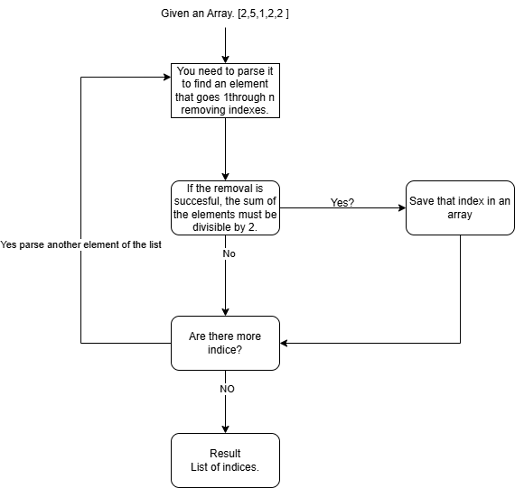

# ProgrammingParadigm
The programming paradigm chosen was the Functional. To represent it I will complete a problem in 
Codeforces implementing this programming paradigm. To understand furthermore what is the functional programming paradigm, we use the definition provided by LLinformatics:"A programming paradigm that encourages program development to be done purely with functions is called the Functional Programming paradigm (FP)."(Pedro Paranhos, 2025).

This means that functional programming uses only functions as the procedures to develop programs that solve the problems needed to resolve. The benefits of functional programming are several. The most important benefits are:
- Recursion
- Hierarchy in functions
- Concurrency
- Modular Estructure
- Error prevention
- Lambda Calculus Implementation

### What is Lambda Calculus?
Lambda Calculus is  using functions and abstraction to apply procedures without the need of stating variables. Usign elegance in code, we can implement lambda calculus as functional programming by creating complex procedures into simple steps. As represent in the following: " The main ideas are applying a function to an argument and forming functions by abstraction"(The Lambda Calculus (Stanford Encyclopedia of Philosophy), 2023)."
## Description
To develop this paradigm, I will resolve the following problem in CodeForces. The problem chosen is 1077C. Which has the title of Good Array. In this problem it is stated the following. You are given an array of n integers, find all the indices in the array such that after removing the indices. the array becomes good. A condition is that an array is good if there exists an element equal to the sum of all the other elements. There is a following diagram to explain the problem better.


## Models
To develop this solution, functional programming will be fundamental into the implementation of this problem. By using this paradigm we splid the work into five functions. By using recursion we will be able to parse through the array present it and recollect the good indices that an array has. 
- is-in: This function search through the list to see if an element exists in the array. It parse through the list and searches an element.
- sum-list: It sums all the elements on the list. It uses an accumulator to save the sum in each step.
- good?: It verifies the list as good if an element is equal to the sum of all the other elements. This is made by the calculating the total sum with sum-list. If the sum is odd it is impossible, if it is even it looks for sum/2 to exist in the list.
- remove-at: It returns a new list without an element. It parses through the list to reach the position i. Then it creates a new temporary list without that position.
- find-nice: <strong>PRIMARY FUNCTION</strong> It parses the indexes from 1 to n. For each one it calls remove-at, to remove that indeces and verify if it is good with good?. If it is, it saves the indeces in cons.

Why does the paradigm is used:
- Recursion: Instead of loops, each function calls itself to go through the list.
- Pure functions: No function modify original list. All work goes through new lists and elements through that list.
- Function composition: Delegation of responsibilities by hierarchy of functions.
- Immutable Variables: No variable is ever modified.

## Implementation
The language chosen to develop this solution is Dr.Racket. It is used because of the pure language being supportive of the functional programming paradigm. Recursion, immutable data and function composition natively making it ideal for this paradigm.

## Tests
The test develop are the following. Creating base cases and worst cases.
```racket
;;Caso Base
(find-nice '(2 5 1 2 2) 1)
(find-nice '(8 3 5 2)1)
(find-nice '(1 2 3)1)


;;Peores Casos
(find-nice '(2 1 2 4 3) 1)
(find-nice '(1 1 1 1)1)
(find-nice '(7 3 2) 1)
```

## Analysis
The time complexity of the solution is O(n^2). This is because find-nice iterates through all n indices. Fo each index it calls good?, which calls sum-list and is-in?. Basically by naming find-nice and good. 

### Differente Possible Solution

In parallel programming, the work is divided among multiple processors that work independently for the same task. The development is simple. Each processor is given the task to check a single index. Each one works simultaneously and finally they merge the results. By this, you have the same solution in a shorter period of time. 
- You create a pool of processors
- You divide the work and if they are not working= idle state
- Each processor checks 1 index
- All run simultaneously.
- Merge results
O(n/p+p). It iuses that time complexity because the processor only looks for one index, so it only parse through the lsit one time. Since they are working simultaneously, the merge is in a simple step.
### References.
- The Lambda Calculus (Stanford Encyclopedia of Philosophy). (2023, July 25). https://plato.stanford.edu/entries/lambda-calculus/
- Functional Programming Paradigm – All You need to know | LLLNFormatics. (n.d.). https://www.llinformatics.com/blog/functional-programming-paradigm
